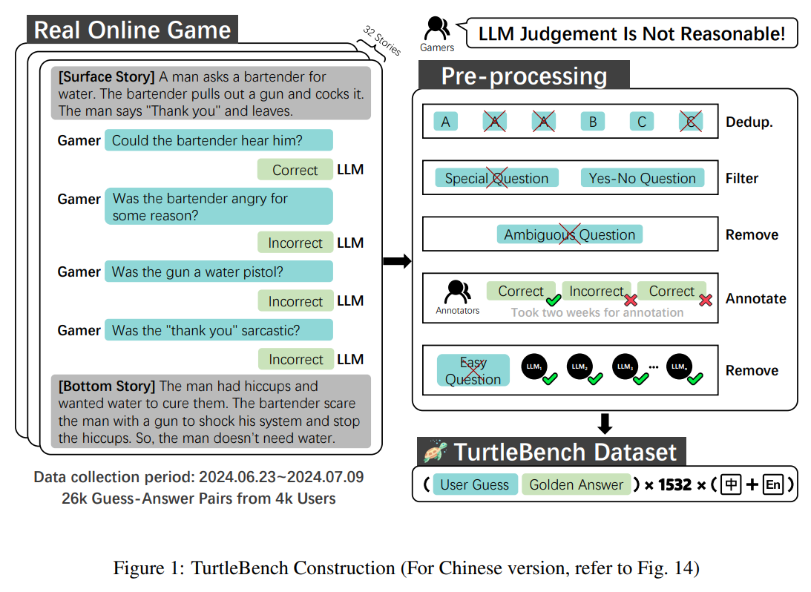
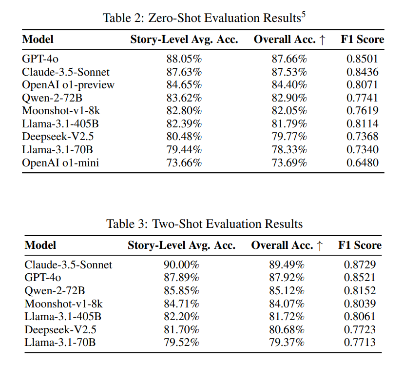

<h1 align="center">
    TurtleBench: Evaluating Top Language Models via Real-World Yes/No Puzzles
</h1>

<p align="center">
    <a href="https://arxiv.org/abs/2410.05262">
        
    </a>
    <a href="https://huggingface.co/datasets/Duguce/TurtleBench1.5k">
        
    </a>
    <a href="https://tanghenre.com">
        
    </a>
    <br>
    <a href="https://mazzzystar.github.io/2024/08/09/turtle-benchmark-zh/">
        
    </a>
    <a href="https://opensource.org/license/apache-2-0">
        
    </a>
</p>

TurtleBench is a dynamic evaluation benchmark designed to assess the reasoning capabilities of large language models (LLMs) through real-world yes/no puzzles, emphasizing logical reasoning over knowledge recall by using user-generated data from a Turtle Soup puzzle platform.

<p align="center"></p>

## Highlights
- Objective and Unbiased: Eliminates the need for background knowledge, focusing purely on reasoning abilities.
- Quantifiable Results: Clear, measurable outcomes (correct/incorrect/unknown) for easy comparison.
- Constantly Evolving: Uses real user-generated questions, making it impossible to "game" the system.
- Language Understanding: Tests the model's ability to comprehend context and make logical inferences.

## Quick Start
```
# Install dependencies
conda create -n turtle python=3.10
conda activate turtle
pip install -r requirements.txt

# Set up configuration
mv config_example.ini config.ini
# Edit config.ini to add your API key

# Run evaluations
python eval.py --shot 0 --models Claude_3_5_Sonnet --language zh --save_interval 10 --time_delay 2

# Analyze results
python analyst.py
```

## Project Structure
```
.
├── README.md                  # Project description and documentation
├── analyst.py                 # Data analysis script
├── archived                   # Archived result files
├── config.ini                 # Configuration file (for actual run)
├── config_example.ini         # Example configuration file
├── data                       # Directory containing project data
│   ├── en                     # Subdirectory for English data
│   └── zh                     # Subdirectory for Chinese data
├── eval.py                    # Evaluation script
├── insights                   # Analysis and visualization-related scripts
│   ├── case_handler.py         # OpenAI o1 Error case handling script
│   ├── plots.ipynb             # Data visualization and plot generation
│   ├── token_boxplot.py        # Box plot for token usage
│   └── token_cal.py            # Token calculation script
├── logs                       # Directory for storing logs
├── models.py                  # Model definition script
├── outputs                    # Directory for storing output results
├── prompts                    # Files related to prompt generation
├── requirements.txt           # Project dependencies list
└── stats                      # Statistics and result-related files
```
## Results
**Note**: You can find detailed experiment results in the [archived directory](./archived/).
<p align="center"></p>


## Citation
```
@article{TurtleBench,
      title={TurtleBench: Evaluating Top Language Models via Real-World Yes/No Puzzles}, 
      author={Qingchen Yu and Shichao Song and Ke Fang and Yunfeng Shi and Zifan Zheng and Hanyu Wang and Simin Niu and Zhiyu Li},
      journal={arXiv preprint arXiv:2410.05262},
      year={2024},
}
```